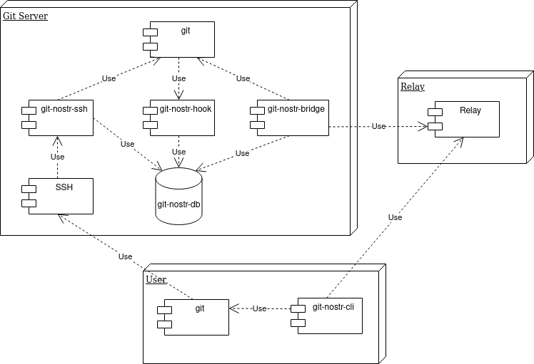

# gitnostr by @spearson78

A proof of concept integration of git and nostr providing

- repository management
- ssh-key management
- repository permission management

This will hopefully form part of a solution for creating a decentralized version of the github/gitlab experience.

I chose to build on top of the existing git tooling to allow the client side dev tools to remain largely unchanged for daily work (standard git commands work including push and pull)

By storing the config on Nostr your repository configuration can be easily regenerated a new host if your current git provider decides to censor you.

See a demo video here: https://www.youtube.com/watch?v=G-WzlC8XfW4

There is much more to a decentralized github/gitlab experience than just a repository. It would also be advantageous to move pull requests and issues to the Nostr protocol. These should however be treated as separate projects that will hopefully be interopable with this project's approach to repository management.


# How



## git-nostr-db

An sqlite DB is used to cache the latest version of the data needed to perform access control checks to avoid development downtime in case of a relay or the git-nostr-bridge being offline.

### git-nostr-bridge

Connects to a set of relays and:
1. subscribes to the events needed to keep the git-nostr-db up to date
2. creates git repositories as needed
3. updates the ssh authorized_keys file

**DO NOT RUN THE BRIDGE AS YOUR OWN USER YOU WILL LOSE YOUR AUTHORIZED_KEYS FILE**

### git-nostr-ssh

Configured as the command for a nostr users ssh-key in the authorized_keys file.
Whenever a user tries to perform a git operation (push/pull) git-nostr-ssh will perform an access control check.

### git-nostr-hook

TODO: not implemented yet.

Will enable fine grain branch control e.g. prevent pushing to specific branches or force pushing to a branch.

### git-nostr-cli (gn)

Command line tool with similar options to the github cli that will publish the relevant events using your private key to the configured relays

git-nostr-bridge will then react to these events and update the DB and create any git repos needed.


# Setup Instructions

**Currently this project is Linux only**
**Go version 1.20+ is required**
**It is recommended to use a local private relay for testing. Testing was performed using https://github.com/scsibug/nostr-rs-relay**

## git-nostr-bridge

**These instructions are needed if you intend to host git repositories. If another nostr user has configured a git-nostr-bridge for you then follwo the git-nostr-cli instructions below.**

Create a new user to host the git repositories (This is needed as the bridge will overwrite the authroized_keys file) and switch to the new account

**DO NOT RUN THE BRIDGE AS YOUR OWN USER YOU WILL LOSE YOUR AUTHORIZED_KEYS FILE**

```bash
sudo useradd --create-home git-nostr
sudo su - git-nostr
```

Clone the gitnostr repository and build the bridge components

```bash
git clone https://github.com/spearson78/gitnostr
cd gitnostr
make git-nostr-bridge
```

Start the bridge once to create the empty config files. **DO NOT RUN THE BRIDGE AS YOUR OWN USER YOU WILL LOSE YOUR AUTHORIZED_KEYS FILE**

```bash
./bin/git-nostr-bridge
```

You should get the message `no relays connected`

Edit the config file at `~/.config/git-nostr/git-nostr-bridge.json`. The default file should look like this

```
{
    "repositoryDir": "~/git-nostr-repositories",
    "DbFile": "~/.config/git-nostr/git-nostr-db.sqlite",
    "relays": [],
    "gitRepoOwners": []
}
```

Add your relay of relays to the list of relays. **You should use a local relay for testing until the implementation is finalized.**
Add your public key to the list of gitRepoOwners. **It is recommended to generate a new nostr private/public key pair for testing**

git-nostr-bridge will follow events published by gitRepoOwners and create git repositories for them.

My local testing config looks like this

```
{
    "repositoryDir": "~/git-nostr-repositories",
    "DbFile": "~/.config/git-nostr/git-nostr-db.sqlite",
    "relays": ["ws://localhost:8080"],
    "gitRepoOwners": ["e0e7807d354ea7662412d99856335e1923b0b57b6668575bf320837f6b1816e3"]
}
```

You can now start the bridge again. **DO NOT RUN THE BRIDGE AS YOUR OWN USER YOU WILL LOSE YOUR AUTHORIZED_KEYS FILE**

```bash
./bin/git-nostr-bridge
```

As no events have been published you should see no console output.

Your git-nostr-bridge is now ready for use

## git-nostr-cli (gn)

**Watch out for a conflict with the gn command from https://gn.googlesource.com **

Clone the gitnostr repository and build the cli components

```bash
git clone https://github.com/spearson78/gitnostr
cd gitnostr
make git-nostr-cli
```

run the git-nostr-cli command once to create the default config file

```bash
./bin/gn
```

You should get the message `no relays connected`

Edit the config file at `~/.config/git-nostr/git-nostr-cli.json`. The default file should look like this

```
{
    "relays": [],
    "privateKey": "",
    "gitSshBase": ""
}
```

Add your relay of relays to the list of relays. **You should use a local relay for testing until the implementation is finalized.**
Set your private key. **It is recommended to generate a new nostr private key for testing**
Set gitSshBase to the ssh user@hostname where a git-nostr-bridge has been installed.

My local testing config looks like this

```
{
    "relays": ["ws://localhost:8080"],
    "privateKey": "...",
    "gitSshBase": "git-str@localhost"
}
```

Publish your ssh-key. you may need to replace id_rsa.pub with the correct public key file

```bash
./bin/gn ssh-key add ~/.ssh/id_rsa.pub
```

Create a test repository and clone it. replace <publickey> with the hex represenation of your public key. If you are using a nip05 capable public key you can use the nip05 identifier instead.

```bash
./bin/gn repo create test
./bin/gn repo clone  <publickey>:test
```

You can set write permission for your repository with the following command. replace <publickey> with the hex represenation of your public key. If you are using a nip05 capable public key you can use the nip05 identifier instead.

```bash
./bin/gn repo permissions test <publickey> WRITE
```
